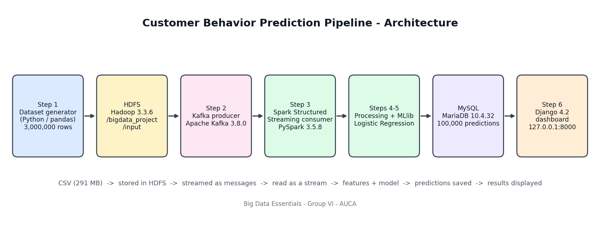

# Customer Behavior Prediction Pipeline

**Big Data Essentials - Course Project (Group VI)**
Adventist University of Central Africa (AUCA), Faculty of Information Technology

Group members: BYIRINGIRO Elie Yvan, KINANIRA NTWARI Christian, NDAYISHIMIYE Patience

An end-to-end big data pipeline that generates 3,000,000 customer interaction records, stores them in **HDFS**, streams them through **Apache Kafka**, processes them with **PySpark**, trains a **Spark MLlib** Logistic Regression model, stores predictions in **MySQL** and shows them on a **Django** dashboard.



## Repository structure

```
.
├── README.md
├── requirements.txt
├── scripts/
│   ├── generate_dataset.ipynb   Step 1  - generates the 3,000,000-row CSV
│   ├── kafka_producer.ipynb     Steps 2-5 - Kafka producer, PySpark processing, MLlib, MySQL insert
│   └── spark_consumer.ipynb     Step 3  - Spark Structured Streaming consumer
├── dashboard/                   Step 6  - Django project (manage.py, dashboard/, predictions/)
├── data/
│   └── sample_customer_behavior.csv   first 1,000 rows of the dataset
└── docs/
    ├── BigData_GroupVI_Final_Report.docx   full project report
    ├── architecture.png
    └── screenshots/             evidence of each stage
```

The dataset (`customer_behavior.csv`, 291 MB) is **not** stored in the repository because it exceeds GitHub's 100 MB file limit. Run `scripts/generate_dataset.ipynb` to recreate it (seed 42); a 1,000-row sample is in `data/`.

## Technologies and versions

| Component | Version |
|---|---|
| Windows | 10 |
| Java JDK | 17.0.10 |
| Python (Anaconda) | 3.12.7 |
| Apache Hadoop (HDFS) | 3.3.6 |
| Apache Kafka | 3.8.0 (Scala 2.13), Zookeeper 3.8.4 |
| Apache Spark / PySpark / MLlib | 3.5.8 (Scala 2.12) |
| Spark-Kafka connector | `org.apache.spark:spark-sql-kafka-0-10_2.12:3.5.8` |
| MariaDB (XAMPP, MySQL-compatible) | 10.4.32 |
| Django | 4.2.30 |

## How to run

1. Start MySQL (and Apache) in XAMPP.
2. Start HDFS: `start-dfs.cmd`
3. Start Zookeeper and Kafka (separate windows, from `C:\kafka`):
   ```
   java -cp "libs\*" org.apache.zookeeper.server.quorum.QuorumPeerMain config\zookeeper.properties
   java -cp "libs\*" kafka.Kafka config\server.properties
   ```
4. Generate the dataset with `scripts/generate_dataset.ipynb`, then upload it:
   ```
   hdfs dfs -mkdir -p /bigdata_project/input
   hdfs dfs -put customer_behavior.csv /bigdata_project/input/
   ```
5. Run `scripts/kafka_producer.ipynb` from the top (producer, Spark read, processing, MLlib, MySQL insert).
6. Start the dashboard and open http://127.0.0.1:8000
   ```
   cd dashboard
   python manage.py runserver
   ```

Install the Python packages with `pip install -r requirements.txt`. Full details are in the report.

## Results

| Metric | Value |
|---|---|
| Records streamed through Kafka | 3,000,000 |
| Training / test records | 2,400,782 / 599,218 |
| Model | Logistic Regression (MLlib) |
| AUC | 0.4993 |
| Predictions stored in MySQL | 100,000 |

The pipeline works end to end with no records lost. The model predicts no better than chance because the synthetic `will_purchase` label was generated independently of the features. See the report (Sections 7 and 9) for the explanation and planned improvements.

## Documentation

The full report is in [`docs/BigData_GroupVI_Final_Report.docx`](docs/BigData_GroupVI_Final_Report.docx).
